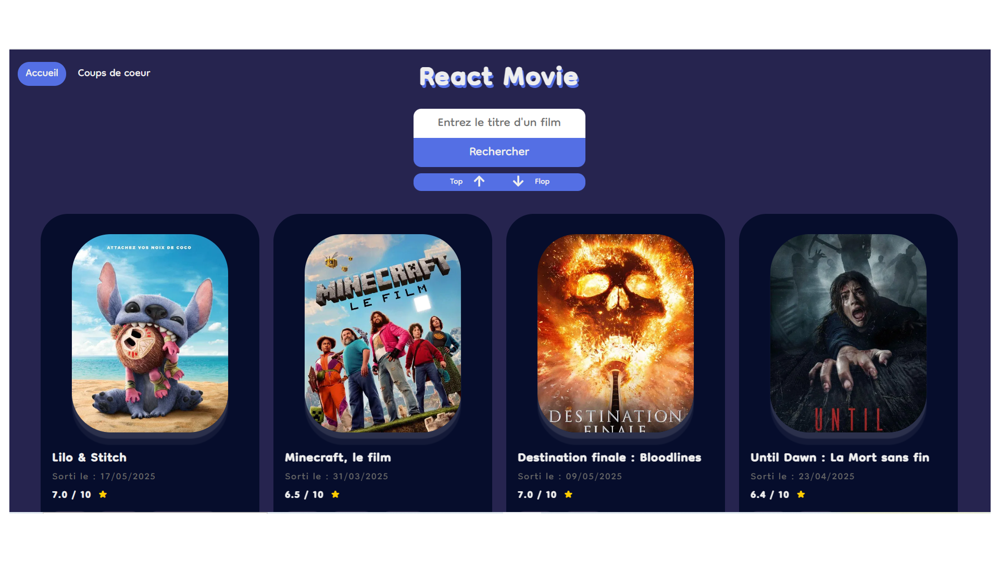

# 🎬 Ciné-app - Application de Recherche de Films

## 📸 Aperçu



## 🌐 Lien vers l'application

[Visiter l'application](https://cine-app-react-fanny.netlify.app/)

## 🚀 Technologies Utilisées

- **React.js** - Framework JavaScript pour la construction de l'interface utilisateur
- **Axios** - Pour les requêtes HTTP vers l'API TMDB
- **SASS** - Préprocesseur CSS pour une meilleure organisation des styles
- **LocalStorage** - Pour la persistance des données des films favoris
- **CSS** - Pour le style et la mise en page responsive

## ✨ Fonctionnalités Principales

- 🔍 Recherche de films en temps réel
- 📊 Tri des films par popularité (top/flop)
- ⭐ Système de favoris avec persistance locale
- 🎭 Affichage des genres de films
- 📱 Design responsive

## 💡 Points Forts Techniques

- Utilisation des Hooks React (useState, useEffect)
- Gestion d'état avec React
- Intégration d'API REST (The Movie Database API)
- Persistance des données avec localStorage
- Composants réutilisables
- Gestion des événements utilisateur
- Tri et filtrage des données

## 🛠️ Installation et Démarrage

1. Cloner le repository

```bash
git clone git@github.com:ProjetsDevFanny/FormationFS-REACT-TP2-Cine-app.git
```

2. Installer les dépendances

```bash
npm install
npm install sass react-router-dom axios react-icons
```

Les dépendances principales incluent :

- react-router-dom (pour la navigation)
- axios (pour les requêtes HTTP)
- sass (pour le préprocesseur CSS)
- react-icons (pour les icônes)

3. Lancer l'application

```bash
npm start
```

## 📝 À Propos

Cette application a été développée dans le cadre d'un projet de formation React, démontrant les compétences en développement front-end moderne et l'intégration d'API.

## 🧠 Approche de Développement

Dans le développement de ce projet, j'ai utilisé des outils d'IA (Cursor AI et ChatGPT) comme assistants de programmation. Cette approche m'a permis de :

- Explorer différentes méthodes de résolution de problèmes
- Comprendre en profondeur chaque ligne de code avant de l'implémenter
- Comparer les différentes approches possibles pour choisir la plus adaptée
- Accélérer mon apprentissage tout en maintenant une compréhension approfondie

Je m'engage à ne jamais utiliser de code que je ne comprends pas complètement, privilégiant toujours la compréhension et l'apprentissage sur la simple copie de code.

## 🔑 API Utilisée

- The Movie Database (TMDB) API pour les données des films
